# 🎬 Streamia - Arquitectura de Microservicios

## Índice
1. [Visión General](#visión-general)
2. [Arquitectura del Sistema](#arquitectura-del-sistema)
3. [Microservicios Identificados](#microservicios-identificados)
4. [Patrones de Diseño](#patrones-de-diseño)
5. [Comunicación entre Servicios](#comunicación-entre-servicios)
6. [Stack Tecnológico](#stack-tecnológico)
7. [Infraestructura y Orquestación](#infraestructura-y-orquestación)
8. [Testing y Observabilidad](#testing-y-observabilidad)
9. [Flujos de Datos](#flujos-de-datos)
10. [Plan de Implementación](#plan-de-implementación)

---

## Visión General

Streamia es una plataforma de streaming de películas que actualmente opera como un monolito en Node.js/Express. Este documento describe la arquitectura propuesta para transformar el sistema en una arquitectura basada en microservicios, diseñada desde cero tomando como referencia las funcionalidades del monolito existente.

### Diagrama de Contexto del Sistema

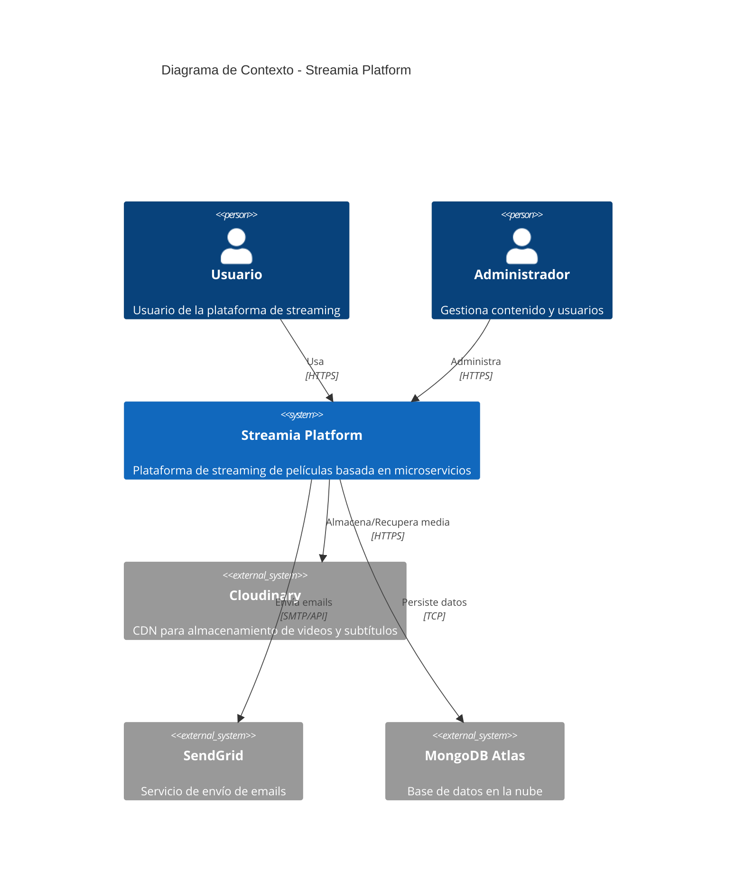

---

## Arquitectura del Sistema

### Diagrama de Arquitectura General

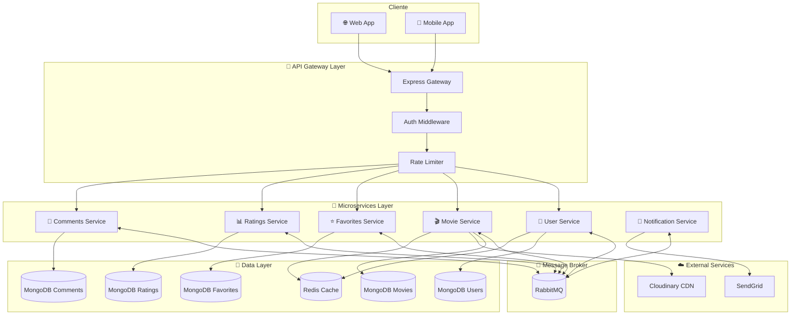

### Diagrama de Contenedores (C4)

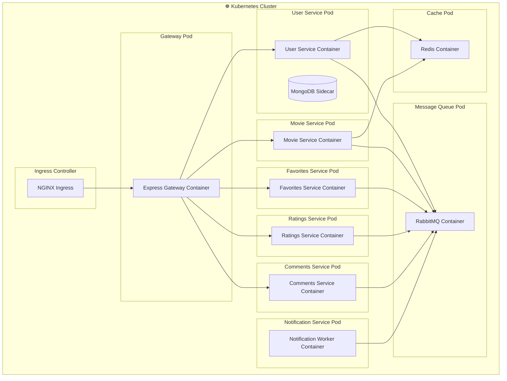

---

## Microservicios Identificados

Basándonos en el análisis del monolito actual, se identifican **6 microservicios** principales:

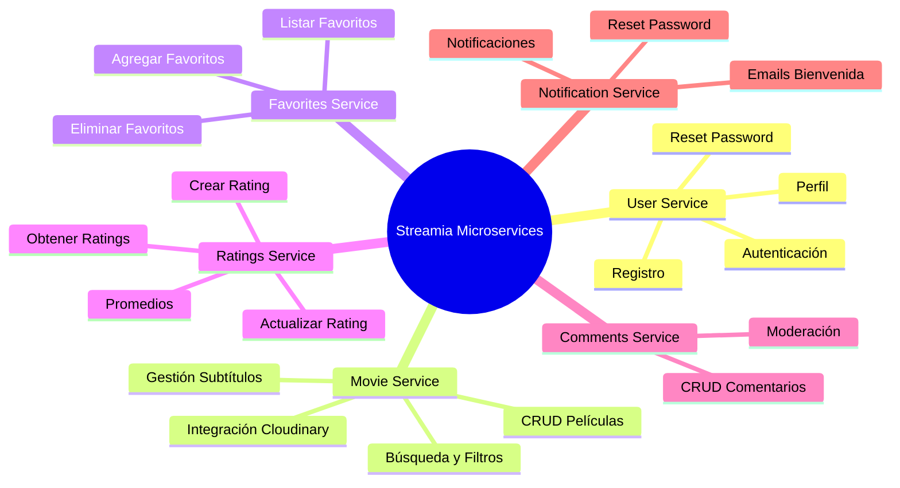

### Tabla de Responsabilidades

| Microservicio | Responsabilidad Principal | Base de Datos | Eventos Publicados | Eventos Consumidos |
|---------------|--------------------------|---------------|--------------------|--------------------|
| **User Service** | Gestión de usuarios y autenticación | MongoDB (users) | `user.registered`, `user.deleted`, `password.reset.requested` | - |
| **Movie Service** | Catálogo de películas y media | MongoDB (movies) | `movie.created`, `movie.deleted`, `movie.updated` | `user.deleted` |
| **Favorites Service** | Películas favoritas por usuario | MongoDB (favorites) | `favorite.added`, `favorite.removed` | `user.deleted`, `movie.deleted` |
| **Ratings Service** | Sistema de calificaciones | MongoDB (ratings) | `rating.created`, `rating.updated` | `user.deleted`, `movie.deleted` |
| **Comments Service** | Comentarios en películas | MongoDB (comments) | `comment.created`, `comment.deleted` | `user.deleted`, `movie.deleted` |
| **Notification Service** | Envío de emails y notificaciones | Redis (jobs queue) | - | `user.registered`, `password.reset.requested` |

---

## Patrones de Diseño

### 1. Saga Pattern (Requerido) ✅

El patrón Saga se utiliza para manejar transacciones distribuidas que involucran múltiples microservicios. En Streamia, el escenario principal es la **eliminación de un usuario**, que debe propagar cambios a través de múltiples servicios.

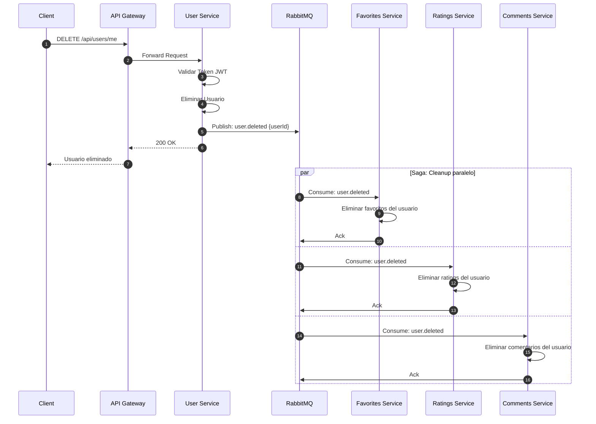

#### Saga: Eliminación de Película

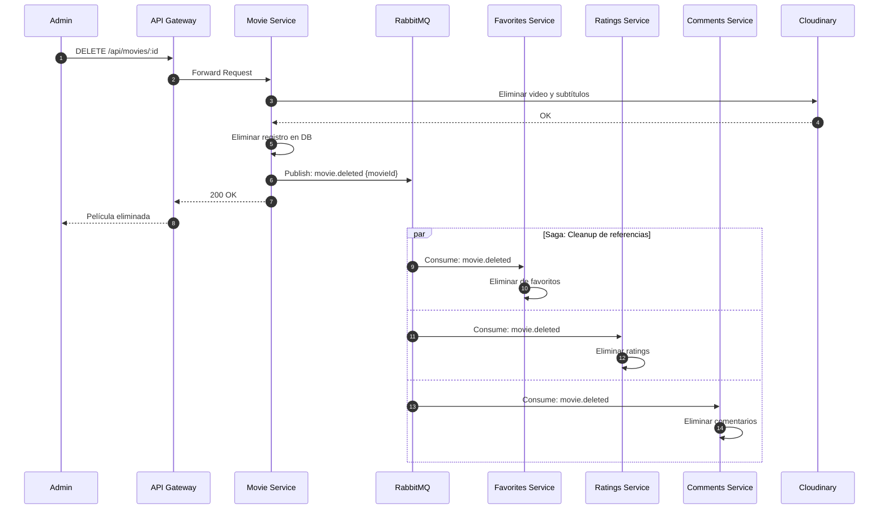

### 2. API Gateway Pattern ✅

Express Gateway actúa como punto de entrada único para todas las solicitudes del cliente.

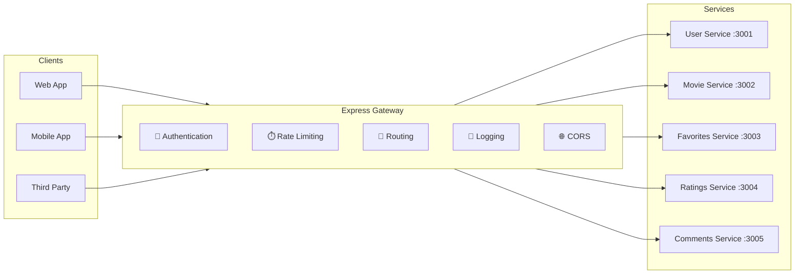

**Responsabilidades del API Gateway:**
- **Autenticación centralizada**: Validación de JWT tokens
- **Rate Limiting**: Protección contra abuso (heredado del monolito)
- **Routing**: Enrutamiento inteligente hacia microservicios
- **CORS**: Gestión de políticas cross-origin
- **Logging**: Registro centralizado de requests

### 3. Circuit Breaker Pattern ✅

Protege el sistema de fallos en cascada cuando un servicio no responde.

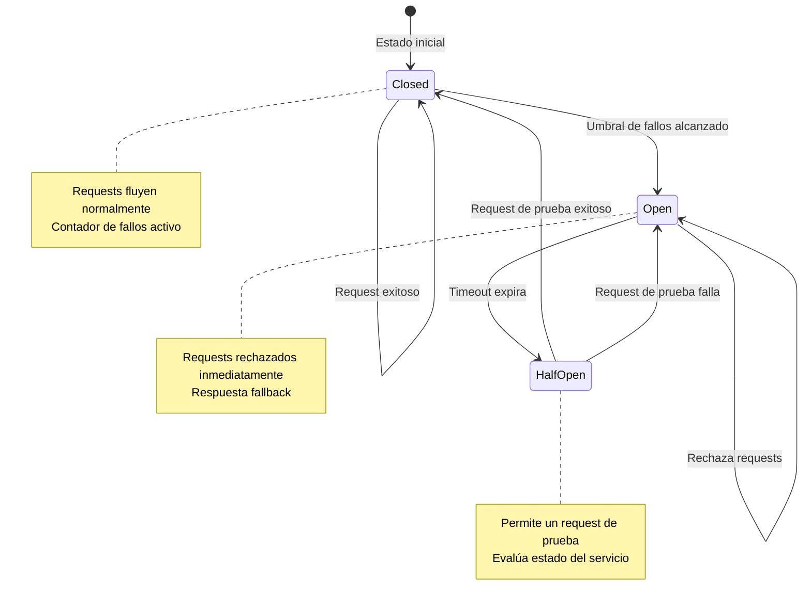

**Implementación con `opossum` (Node.js):**
- Timeout: 3 segundos
- Umbral de error: 50%
- Reset timeout: 30 segundos

### 4. Database per Service Pattern ✅

Cada microservicio tiene su propia base de datos, garantizando el desacoplamiento y la autonomía.

```mermaid
flowchart TB
    subgraph UserService["User Service"]
        US[Service Logic]
        US_DB[(MongoDB<br/>users collection)]
    end

    subgraph MovieService["Movie Service"]
        MS[Service Logic]
        MS_DB[(MongoDB<br/>movies collection)]
    end

    subgraph FavoritesService["Favorites Service"]
        FS[Service Logic]
        FS_DB[(MongoDB<br/>favorites collection)]
    end

    subgraph RatingsService["Ratings Service"]
        RS[Service Logic]
        RS_DB[(MongoDB<br/>ratings collection)]
    end

    subgraph CommentsService["Comments Service"]
        CS[Service Logic]
        CS_DB[(MongoDB<br/>comments collection)]
    end

    US --> US_DB
    MS --> MS_DB
    FS --> FS_DB
    RS --> RS_DB
    CS --> CS_DB

    style US_DB fill:#4db33d
    style MS_DB fill:#4db33d
    style FS_DB fill:#4db33d
    style RS_DB fill:#4db33d
    style CS_DB fill:#4db33d
```

---

## Comunicación entre Servicios

### Coreografía vs Orquestación

**Decisión: Enfoque basado en Coreografía** ✅

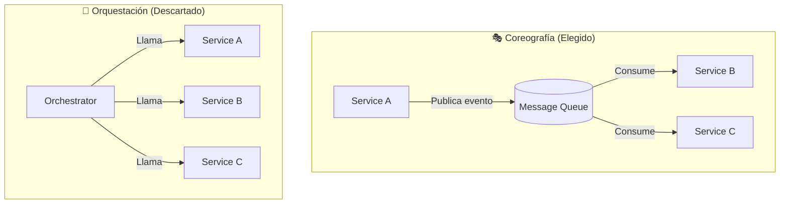

#### Justificación de la Coreografía

| Aspecto | Coreografía ✅ | Orquestación ❌ |
|---------|---------------|-----------------|
| **Acoplamiento** | Bajo - servicios independientes | Alto - dependencia del orquestador |
| **Punto único de fallo** | No existe | El orquestador es crítico |
| **Escalabilidad** | Alta - cada servicio escala independiente | Media - orquestador puede ser cuello de botella |
| **Complejidad** | Distribuida (en cada servicio) | Centralizada (en orquestador) |
| **Debugging** | Más difícil (trazas distribuidas) | Más fácil (flujo centralizado) |
| **Flexibilidad** | Alta - agregar servicios es simple | Media - requiere modificar orquestador |

**Ventajas para Streamia:**
1. **Desacoplamiento natural**: Los servicios de favoritos, ratings y comentarios no necesitan conocerse entre sí
2. **Resiliencia**: Si un servicio falla, los demás continúan funcionando
3. **Escalabilidad**: Cada servicio puede escalarse según su demanda

**Trade-offs aceptados:**
1. **Trazabilidad**: Se mitigará con distributed tracing (Jaeger)
2. **Consistencia eventual**: Aceptable para el dominio de streaming
3. **Debugging**: Se implementará logging estructurado

### Tipos de Comunicación

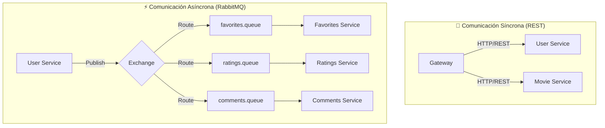

### Estructura de Eventos en RabbitMQ

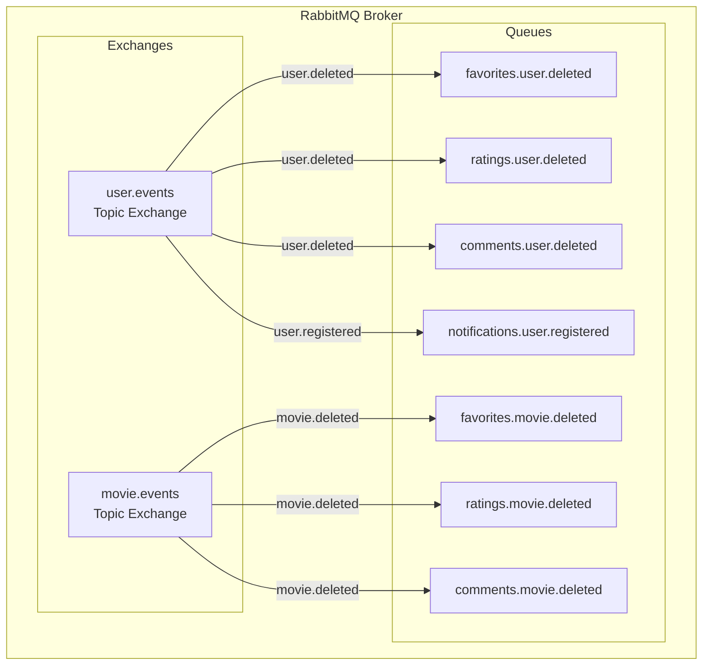

---

## Stack Tecnológico

### Diagrama de Tecnologías

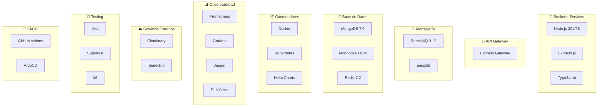

### Tabla de Herramientas

| Categoría | Herramienta | Justificación |
|-----------|-------------|---------------|
| **Runtime** | Node.js 20 LTS | Continuidad con monolito, ecosistema maduro |
| **Framework** | Express.js | Ligero, conocido por el equipo |
| **Lenguaje** | TypeScript | Type safety, mejor DX |
| **API Gateway** | Express Gateway | Fácil integración con Express, plugins |
| **Message Broker** | RabbitMQ | Robusto, soporte para múltiples patrones |
| **Base de Datos** | MongoDB | Continuidad, flexibilidad de esquema |
| **Cache** | Redis | Sesiones, cache, rate limiting |
| **Contenedores** | Docker | Estándar de la industria |
| **Orquestación** | Kubernetes | Escalabilidad, self-healing |
| **Service Mesh** | Istio (opcional) | Observabilidad avanzada, mTLS |
| **Tracing** | Jaeger | Distributed tracing, integración con K8s |
| **Logging** | ELK Stack | Búsqueda y análisis de logs |
| **Metrics** | Prometheus + Grafana | Alertas, dashboards |
| **CI/CD** | GitHub Actions + ArgoCD | GitOps, despliegue continuo |

---

## Infraestructura y Orquestación

### Arquitectura en Kubernetes

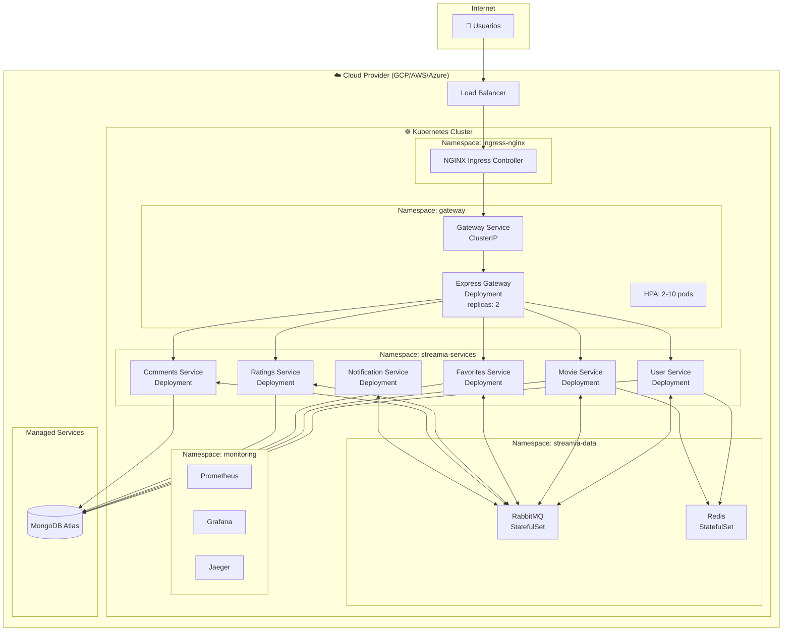

### Estructura de Namespaces

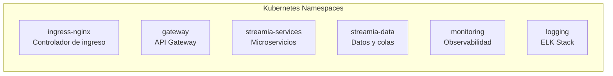

### Recursos de Kubernetes por Servicio

| Servicio | Deployment | Service | HPA | Recursos |
|----------|-----------|---------|-----|----------|
| Gateway | ✅ | ClusterIP | 2-10 pods | 256Mi-512Mi |
| User Service | ✅ | ClusterIP | 2-5 pods | 256Mi-512Mi |
| Movie Service | ✅ | ClusterIP | 3-10 pods | 512Mi-1Gi |
| Favorites Service | ✅ | ClusterIP | 2-5 pods | 256Mi-512Mi |
| Ratings Service | ✅ | ClusterIP | 2-5 pods | 256Mi-512Mi |
| Comments Service | ✅ | ClusterIP | 2-5 pods | 256Mi-512Mi |
| Notification Service | ✅ | - | 1-3 pods | 128Mi-256Mi |
| RabbitMQ | StatefulSet | ClusterIP | - | 512Mi-1Gi |
| Redis | StatefulSet | ClusterIP | - | 256Mi-512Mi |

---

## Testing y Observabilidad

### Estrategia de Testing

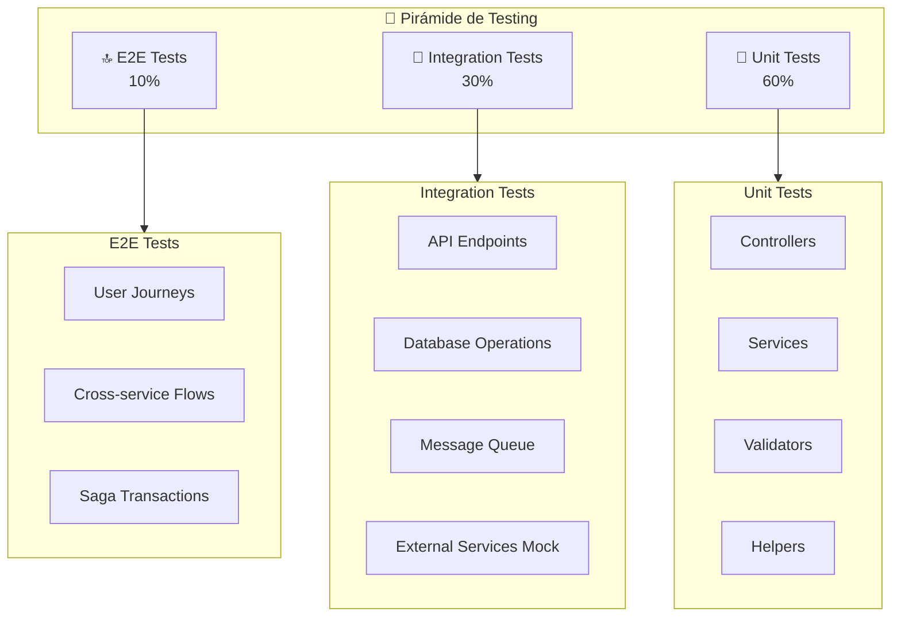

### Tipos de Testing

| Tipo | Herramienta | Cobertura Objetivo | Descripción |
|------|-------------|-------------------|-------------|
| **Unit** | Jest | 80% | Lógica de negocio, validadores, helpers |
| **Integration** | Jest + Supertest | 70% | Endpoints REST, queries a DB |
| **Contract** | Pact | - | Contratos entre servicios |
| **E2E** | k6 + Playwright | Flujos críticos | Journeys completos de usuario |
| **Load** | k6 | - | Performance bajo carga |
| **Chaos** | Chaos Monkey | - | Resiliencia del sistema |

### Stack de Observabilidad

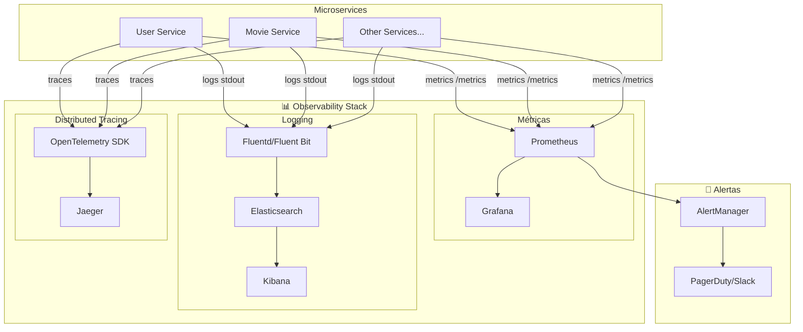

### Métricas Clave (KPIs)

| Métrica | Descripción | Umbral de Alerta |
|---------|-------------|------------------|
| **Request Latency (p99)** | Tiempo de respuesta percentil 99 | > 500ms |
| **Error Rate** | % de requests con error | > 1% |
| **Throughput** | Requests por segundo | < umbral esperado |
| **Pod Restarts** | Reinicios de pods | > 3 en 5 min |
| **Queue Depth** | Mensajes pendientes en RabbitMQ | > 1000 |
| **CPU/Memory** | Uso de recursos | > 80% |

### Dashboards de Grafana

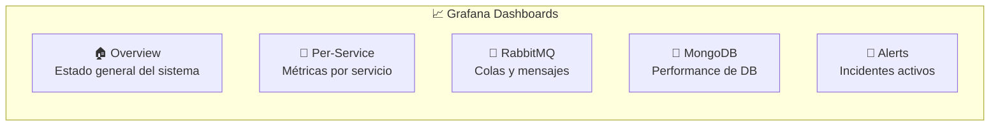

---

## Flujos de Datos

### Flujo: Registro de Usuario

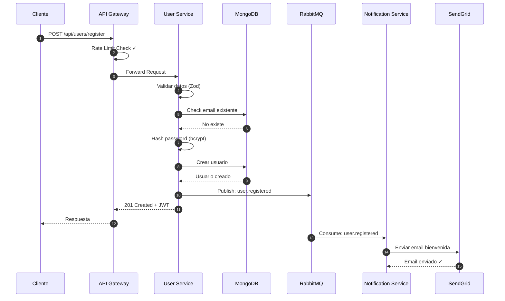

### Flujo: Ver Película y Agregar a Favoritos

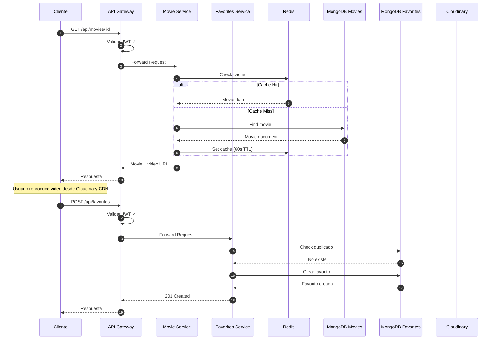

### Flujo: Sistema de Ratings con Agregación

```mermaid
sequenceDiagram
    autonumber
    participant C as Cliente
    participant GW as API Gateway
    participant RS as Ratings Service
    participant DB as MongoDB Ratings
    participant CACHE as Redis

    C->>GW: POST /api/ratings {movieId, rating: 4}
    GW->>GW: Validar JWT ✓
    GW->>RS: Forward Request
    RS->>DB: Upsert rating (userId, movieId)
    DB-->>RS: Rating guardado
    RS->>DB: Aggregate: promedio película
    DB-->>RS: {avg: 4.2, count: 150}
    RS->>CACHE: Update: movie:{id}:rating
    RS-->>GW: 200 OK + nuevo promedio
    GW-->>C: Respuesta

    Note over C,CACHE: El promedio se cachea para consultas rápidas
```

---

## Plan de Implementación

### Fases del Proyecto

```mermaid
gantt
    title Plan de Implementación - Streamia Microservices
    dateFormat  YYYY-MM-DD
    
    section Fase 1: Fundación
    Setup repositorio y CI/CD       :f1, 2025-01-06, 5d
    Infraestructura K8s base        :f2, after f1, 7d
    Express Gateway setup           :f3, after f1, 5d
    RabbitMQ + Redis deploy         :f4, after f2, 3d
    
    section Fase 2: Core Services
    User Service                    :s1, after f4, 10d
    Movie Service                   :s2, after f4, 12d
    Notification Service            :s3, after s1, 5d
    
    section Fase 3: Feature Services
    Favorites Service               :s4, after s2, 7d
    Ratings Service                 :s5, after s2, 7d
    Comments Service                :s6, after s2, 7d
    
    section Fase 4: Integración
    Sagas implementation            :i1, after s6, 7d
    Circuit breakers                :i2, after i1, 3d
    Integration testing             :i3, after i2, 5d
    
    section Fase 5: Observabilidad
    Prometheus + Grafana            :o1, after i3, 5d
    ELK Stack                       :o2, after o1, 5d
    Jaeger tracing                  :o3, after o2, 3d
    
    section Fase 6: Go Live
    Load testing                    :g1, after o3, 5d
    Security audit                  :g2, after g1, 3d
    Production deploy               :g3, after g2, 2d
```

### Estructura de Repositorios

```mermaid
flowchart TB
    subgraph MonoRepo["📁 Monorepo (Recomendado)"]
        ROOT[streamia-microservices/]
        
        subgraph Packages
            P1[packages/shared/<br/>Types, Utils, Contracts]
            P2[packages/message-schemas/<br/>Event definitions]
        end
        
        subgraph Services
            S1[services/gateway/]
            S2[services/user-service/]
            S3[services/movie-service/]
            S4[services/favorites-service/]
            S5[services/ratings-service/]
            S6[services/comments-service/]
            S7[services/notification-service/]
        end
        
        subgraph Infra
            I1[infra/kubernetes/<br/>K8s manifests]
            I2[infra/helm/<br/>Helm charts]
            I3[infra/terraform/<br/>Cloud resources]
        end
        
        subgraph CI
            C1[.github/workflows/<br/>CI/CD pipelines]
        end
    end

    ROOT --> Packages & Services & Infra & CI
```

### Checklist de Implementación

```mermaid
flowchart TB
    subgraph Phase1["✅ Fase 1: Fundación"]
        P1_1[☐ Crear monorepo con Turborepo/Nx]
        P1_2[☐ Configurar TypeScript compartido]
        P1_3[☐ Setup Docker Compose local]
        P1_4[☐ Configurar GitHub Actions]
        P1_5[☐ Deploy K8s cluster base]
    end
    
    subgraph Phase2["🔧 Fase 2: Core Services"]
        P2_1[☐ User Service + Tests]
        P2_2[☐ Movie Service + Cloudinary]
        P2_3[☐ Express Gateway config]
        P2_4[☐ RabbitMQ exchanges/queues]
        P2_5[☐ Notification worker]
    end
    
    subgraph Phase3["⭐ Fase 3: Features"]
        P3_1[☐ Favorites Service]
        P3_2[☐ Ratings Service]
        P3_3[☐ Comments Service]
        P3_4[☐ Event consumers]
    end
    
    subgraph Phase4["🔗 Fase 4: Integración"]
        P4_1[☐ Implementar Sagas]
        P4_2[☐ Circuit Breakers]
        P4_3[☐ Retry policies]
        P4_4[☐ Dead letter queues]
    end
    
    subgraph Phase5["📊 Fase 5: Observabilidad"]
        P5_1[☐ Prometheus metrics]
        P5_2[☐ Grafana dashboards]
        P5_3[☐ ELK logging]
        P5_4[☐ Jaeger tracing]
        P5_5[☐ AlertManager rules]
    end

    Phase1 --> Phase2 --> Phase3 --> Phase4 --> Phase5
```

---

## Resumen Ejecutivo

### Arquitectura Propuesta

| Aspecto | Decisión | Razón |
|---------|----------|-------|
| **Microservicios** | 6 servicios + 1 gateway | Separación por dominio de negocio |
| **Comunicación** | Coreografía con RabbitMQ | Desacoplamiento, resiliencia |
| **Patrón principal** | Saga (Choreography-based) | Transacciones distribuidas sin orquestador |
| **API Gateway** | Express Gateway | Compatibilidad con stack actual |
| **Orquestación** | Kubernetes | Escalabilidad, auto-healing |
| **Base de datos** | MongoDB (Database per Service) | Autonomía de servicios |
| **Observabilidad** | Prometheus + Grafana + Jaeger + ELK | Stack completo de monitoreo |

### Beneficios Esperados

```mermaid
flowchart LR
    subgraph Benefits["🎯 Beneficios"]
        B1[📈 Escalabilidad<br/>independiente]
        B2[🔧 Mantenibilidad<br/>mejorada]
        B3[🚀 Despliegues<br/>independientes]
        B4[💪 Resiliencia<br/>ante fallos]
        B5[👥 Equipos<br/>autónomos]
    end
```

### Riesgos y Mitigaciones

| Riesgo | Probabilidad | Impacto | Mitigación |
|--------|--------------|---------|------------|
| Complejidad operacional | Alta | Alto | Automatización, IaC, GitOps |
| Debugging distribuido | Media | Medio | Jaeger tracing, correlation IDs |
| Consistencia de datos | Media | Alto | Sagas, idempotencia, compensación |
| Latencia de red | Baja | Medio | Cache, circuit breakers |
| Curva de aprendizaje | Media | Medio | Documentación, capacitación |

---

## Referencias y Recursos

- [Microservices Patterns - Chris Richardson](https://microservices.io/patterns/)
- [Express Gateway Documentation](https://www.express-gateway.io/docs/)
- [RabbitMQ Tutorials](https://www.rabbitmq.com/getstarted.html)
- [Kubernetes Documentation](https://kubernetes.io/docs/)
- [The Twelve-Factor App](https://12factor.net/)

---

*Documento generado el 14 de Diciembre de 2025*
*Versión: 1.0.0*
*Proyecto: Streamia Microservices Architecture*
